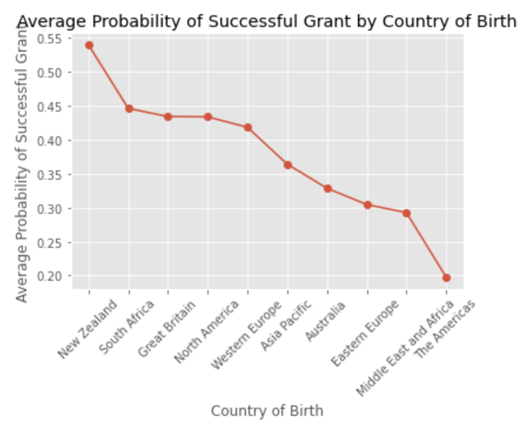
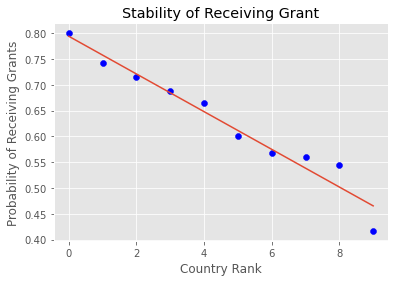
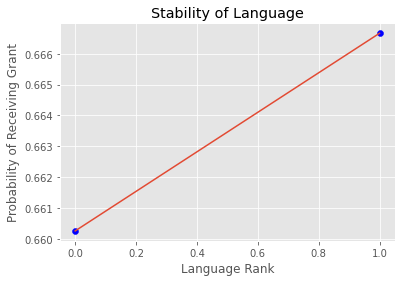
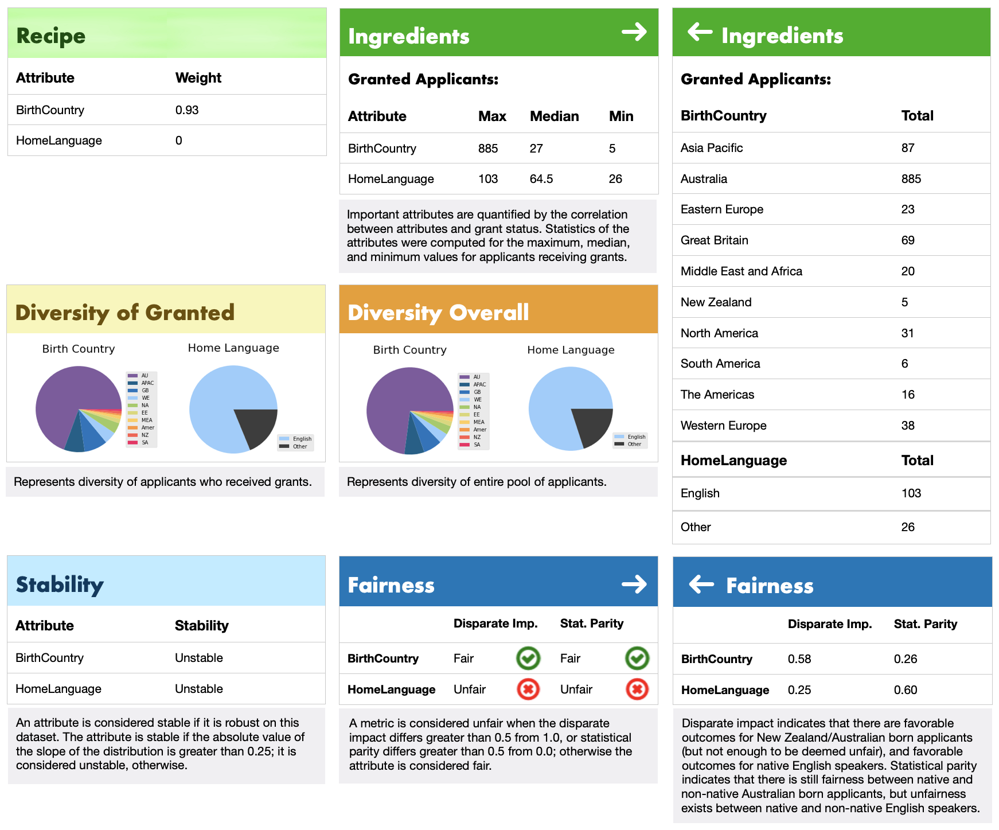

# Data Science University of Melbourne Grant Predictions Interpretability Tool: Project Overview

- Built a visual interpretability tool for a university grant prediction model developed in a Kaggle competition **(Nutritional Label)**
- Engineered missing data and one-hot encoded categorial values
- Investigated attribute weights and disparities within Birth Country and Home Language features (Recipe & Diversity)
- Generated a statistical description across 12 different subpopulations (Ingredients)
- Determined the robustness of prediction methodology on data (Stability)
- Measured the group fairness through disparate impact and statistical parity (Fairness)

## Code and Resources Used

**Python Version:** 3.8.8\
**Packages:** pandas, numpy, sklearn, matplotlib, warnings\
**Source Code:** https://www.kaggle.com/irinana/predict-graint \
**Competition URL:** https://www.kaggle.com/c/unimelb/overview

## Data Collection

The train data consisted of 8700+ University of Melbourne grant applications from late 2005 to 2008, whereas
the test data consisted of 2100+ grant applications from 2009 to mid 2010.

With each application, I got the following about the applicant:
- Applicant ID
- Submission Date
- RFCD Code (Field of study classification)
- RFCD Percentage (If several RFCD codes relevant to applicant)
- SEO Code (Socioeconomic classification)
- SEO Percentage (If several SEO codes relevant to applicant)

I also got the following about the faculty investigator reviewing the application:
- Role
- Faculty Number
- Department Number
- Year of Birth
- Country of Birth
- Home Language
- Level of Seniority
- Number of Years Worked at University of Melbourne
- Number of Academic Journals
- Number of Grants Approved
- Number of Grants Denied

And got information about the grant sponsor:
- Sponsor Code (ID of sponsor)
- Grant Category code (categorization of sponsor)

The grant status was provided for the training set as a binary variable (successful, unsuccessful).

I modeled the interpretability tool around two features across each of their subpopulations:
- Birth Country: AU, APAC, GB, WE, NA, EE, MEA, Amer, NZ, SA
- Home Language: English, Other

## Data Cleaning

After loading the data and reviewing the developed model, the data was in good quality for predictions.
However, I made a few changes to the data in order to build the interpretability tool:
- Removed missing values from RFCD Code
- One-hot encoded categorical variables
- Scaled newly cleaned data

I also made the following columns:
- Grant Status (Prediction of grant status)
- Successful Grant (If grant status was successful or not)
- Native Birth Country (If born in New Zealand or Australia)

The data was now ready to construct the tool.

## EDA

I looked at the distributions of the data to create a concise interpretability tool.
Below are a few highlights:

  
  
  

## Interpretability Tool Widgets

The visual interpretability tool consisted of 5 sections, with investigation on the Birth Country and Home Language features:

- **Recipe**: attribute weights in dataset that correspond to importance in prediction.
- **Ingredients**: statistics of successful grants across 10 Birth Country and 2 Home Language subpopulations.
- **Diversity**: disparities between diversity of applicants predicted a successful grant compared to entire pool of applicants, represented as pie charts for each subpopulation.
- **Stability**: explains if prediction methodology is robust on dataset for each feature based on slope of distribution. If the absolute value of the feature distribution slope is greater than 0.25, it is stable.
- **Fairness**: quantified whether outcomes exhibited disparate impact and/or statistical parity between groups with respect to the sensitive attributes.

## Interpretability Tool Analysis

The tool provided concise, transparent, and easily interpretable findings:
- **Recipe**:
    - Birth Country: 0.93 (strong correlation to grant status)
    - Home Language: 0.0 (no correlation to grant status, surprisingly)
- **Ingredients**:
    - Birth Country: 885 max from Australia, 5 min from New Zealand, 27 median
    - Home Language: 103 max English speaking, 26 min other speaking, 64.5 median
- **Diversity**:
    - Birth Country: slight preference for Australian born investigators to give grants
    - Home Language: no noticeable difference between granted and overall pool
- **Stability**:
    - Birth Country: unstable; slope = -0.037
    - Home Language: unstable; slope = 0.006
- **Fairness**:
    - Birth Country: fair disparate impact and statistical parity (favorable and fair outcomes for New Zealand/Australian born)
    - Home Language: unfair disparate impact and statistical parity (unfavorable and unfair outcomes for non-English speakers)

The interpretability tool is below:

>

